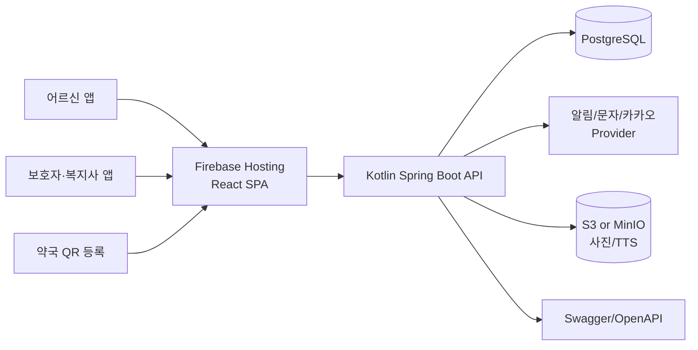

# 🍊 고찌봄

### 약 먹는 순간이, 곧 안부가 되는 서비스

**독거노인을 위한 제주 지역 기반 복약 안부 서비스**

고찌(제주어 `같이`) + 봄(`바라봄 · 살펴봄 · 챙겨봄`)

 

 
 

---

## 🧡 프로젝트 소개

고찌봄은 **제주의 저소득층 65세 이상 독거노인**을 우선 대상으로 하는 복약 안부 서비스입니다.

약국이 QR로 복약 정보를 등록하면, 어르신은 알림이 울릴 때 **먹은 약 포지 사진 한 장**만 촬영합니다.

그러면 복용 여부가 보호자, 가족, 요양보호사, 복지사에게 전달되어 **복약 확인과 안부 확인이 동시에 이루어집니다.**

> 고찌봄은 약을 추천하거나 처방을 바꾸지 않습니다.
>
> 약국이 등록한 복약 정보를 기반으로, 복용 확인과 안부 연결을 돕는 보조 서비스입니다.

---

## 🔍 문제 정의

  

### 1. 어르신에게 복잡한 앱 조작은 장벽입니다

저희는 팀원의 외할머니가 말씀하신 한 문장에서 출발했습니다.

> “한 번은 누르겠는데, 두 번은 너무 헷갈려요.”

젊은 사람에게는 당연한 두세 번의 터치, 메뉴 이동, 설정 과정이 어르신에게는 실제 사용을 막는 벽이 됩니다. 그래서 고찌봄은 어르신에게 요구하는 행동을 **큰 버튼 한 번과 사진 한 장**으로 줄였습니다.

### 2. 돌봄 인력은 부족하고, 확인 업무는 계속 늘어납니다

  

제주 지역은 고령화와 독거노인 증가가 빠르게 진행되고 있지만, 요양보호사와 돌봄 인력은 수요를 따라가기 어렵습니다.

고찌봄은 사람의 돌봄을 대체하려는 서비스가 아니라, **사람이 꼭 확인해야 할 순간을 더 빨리 발견하도록 돕는 서비스**입니다.

### 3. 스마트폰은 있지만, 문제는 ‘복잡함’입니다

  

어르신의 스마트폰 보유율은 높아지고 있지만, 직접 입력하고 설정하는 앱은 여전히 어렵습니다.

반면 카메라는 많은 어르신이 익숙하게 사용하는 기능입니다. 고찌봄은 이 점에 주목해 **복약 확인을 카메라 촬영 경험으로 바꾸었습니다.**

---

## 🌊 왜 제주인가

  

고찌봄은 제주를 첫 파일럿 지역으로 설정했습니다.

| 이유 | 설명 |
| --- | --- |
| 초고령사회 진입 | 제주 65세 이상 인구 비율 증가와 독거노인 가구 증가 |
| 의료 접근성 한계 | 상급종합병원 부재와 육지 원정 진료 부담 |
| 복약 사고 위험 | 다제약물 복용, 깜빡 잊음, 부작용·재입원 위험 |
| 지역 약국 연계 가능성 | 제주시·서귀포시 약국과 보건소·지자체 연계 가능 |

---

## 💡 해결 방식

  

고찌봄의 핵심 흐름은 단순합니다.

| 단계 | 내용 |
| --- | --- |
| 1. QR 등록 | 약국이 발행한 봉투 QR을 찍어 약 이름, 복용 시간, 개수를 자동 등록합니다. |
| 2. 복약 알림 | 정해진 시간에 알림을 보내고, 식전·식후 약은 식사 확인 후 복약 알림으로 이어집니다. |
| 3. 약 포지 사진 | 어르신이 먹은 약 포지 사진을 찍으면 복용 기록이 남습니다. |
| 4. 보호자 알림 | 가족, 요양보호사, 복지사에게 복용 여부와 확인 필요 상태를 전달합니다. |

---

## 🎨 브랜드와 UX 원칙

  

고찌봄은 제주 감귤의 따뜻함과 돌하르방 캐릭터를 활용해, 복약 관리 서비스가 주는 차가운 느낌을 줄였습니다.

### UX 설계 원칙

| 원칙 | 설명 |
| --- | --- |
| 터치 한 번 | 알림을 누르면 바로 복약 확인 화면 또는 카메라로 이어집니다. |
| 복잡함은 밖으로 | QR 등록, 식사 시간, 연락처 설정은 보호자·약국 화면에 둡니다. |
| 사진 한 장 | 어르신은 먹은 약 포지만 찍으면 됩니다. |
| 확인 필요 | 미확인을 복용 실패로 단정하지 않고 사람에게 연결합니다. |

---

## 🏗️ 전체 구조

---

## 🗂️ Repository

| Repository | 역할 | 주요 기술 |
| --- | --- | --- |
| [Tiki-Taka-FE](https://github.com/TIKI-TAKA-hackathon/Tiki-Taka-FE) | 어르신·보호자·복지사 화면, 데모 플로우, Firebase Hosting 배포 | React, TypeScript, Vite, Tailwind CSS |
| [Tiki-Taka-BE](https://github.com/TIKI-TAKA-hackathon/Tiki-Taka-BE) | 복약 안부 도메인 API, DB 모델, 배포 인프라, 알림·미디어 확장 설계 | Kotlin, Spring Boot, PostgreSQL, Docker, Nginx |

---

## 🧪 Demo

| 구분 | 링크 |
| --- | --- |
| Live Demo | https://gojjibom.web.app/ |
| Frontend | https://github.com/TIKI-TAKA-hackathon/Tiki-Taka-FE |
| Backend | https://github.com/TIKI-TAKA-hackathon/Tiki-Taka-BE |

  

---

## 🧭 Roadmap

| 단계 | 기간 | 목표 |
| --- | --- | --- |
| MVP | 0~3개월 | 약국 QR 등록, 복약 알림, 약 포지 사진 확인, 보호자 알림 구현 |
| 파일럿 | 3~6개월 | 제주시 거점 약국·복지관·독거노인 가구 대상 현장 검증 |
| 확장 | 6~12개월 | 제주 전역 약국 연계, 지자체 예산 결합 모델 정착 |
| 전국화 | 12개월+ | 타 지역 지자체·보건소·공공사업 연계 확장 |

---

## ⚠️ 한계와 보완 방향

| 한계 | 보완 방향 |
| --- | --- |
| 약국 협조 없이는 QR 자동 등록이 어렵습니다. | 보건소·거점 약국 시범사업부터 단계적으로 도입합니다. |
| 사진이 복용을 100% 증명하지는 못합니다. | 복용 실패로 단정하지 않고 ‘확인 필요’ 상태로 보호자·약사에게 연결합니다. |
| 어르신 화면을 단순화하면 기능 확장이 어렵습니다. | 기능 추가는 보호자·약국 화면에 두고, 어르신 화면은 단순하게 유지합니다. |
| 요양보호사가 바뀌면 인수인계 공백이 생깁니다. | 복약 이력을 앱에 남겨 새 담당자가 바로 이어받을 수 있도록 합니다. |

---

## 👥 Team Tiki-Taka

| 이름 | 역할 | 담당 |
| --- | --- | --- |
| 김주영 | 팀장 | 서비스 방향성 검토, 심사 대응 피드백, 리스크 검증 |
| 허동현 | PM & Development Lead | 프로젝트 기획, FE/BE 개발 총괄, 서버·배포·연동 설계 |
| 박윤아 | Presentation & Research | 발표 준비, 자료조사, 발표 대본 구성 및 메시지 정리 |
| 강지연 | UX/UI Design | 브랜드 디자인, 앱 화면 디자인, 서비스 첫인상 설계 |
| 이재영 | Research & Evidence | 자료조사, 통계·수치 근거 정리, TTS 자료 준비 |

---

## 🏁 기대효과

  

고찌봄은 대단한 기술보다 **할머니가 혼자서도 누를 수 있는 버튼 하나**에서 시작했습니다.

제주에서 시작한 작은 복약 확인이, 전국의 돌봄 기준이 될 때까지 고찌봄은 성장해 나가겠습니다.
