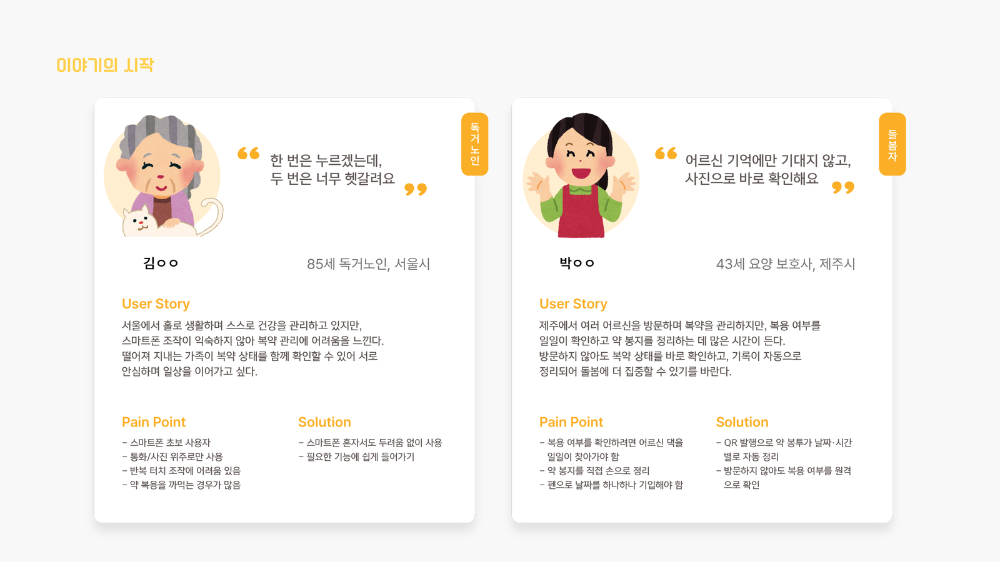
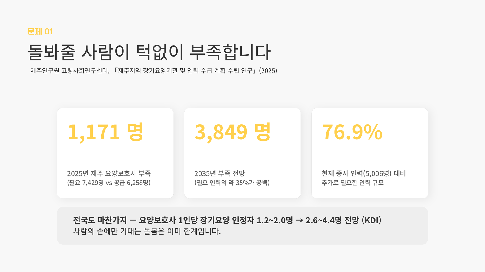
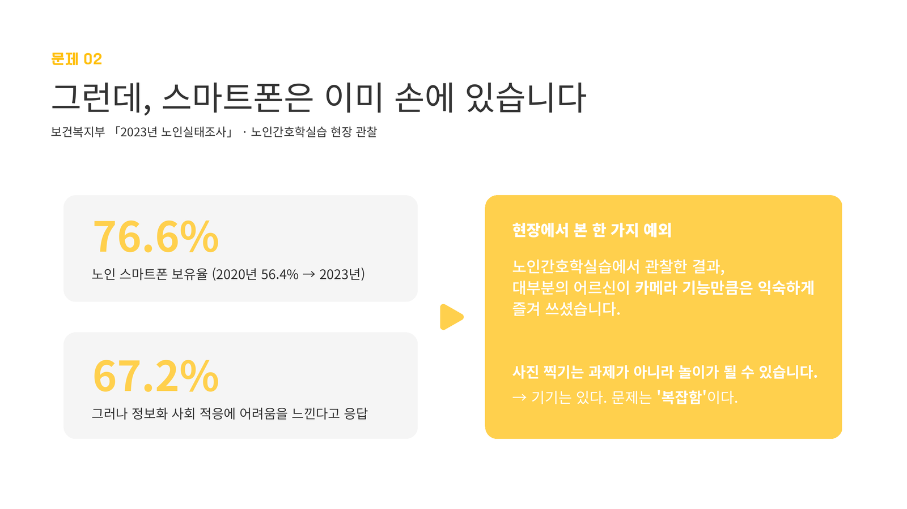
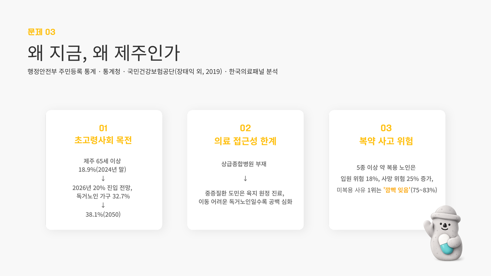
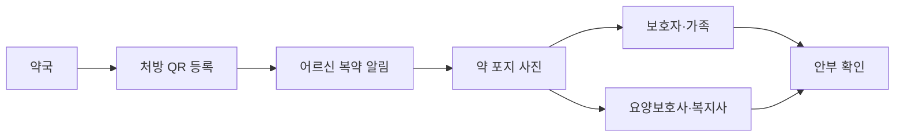
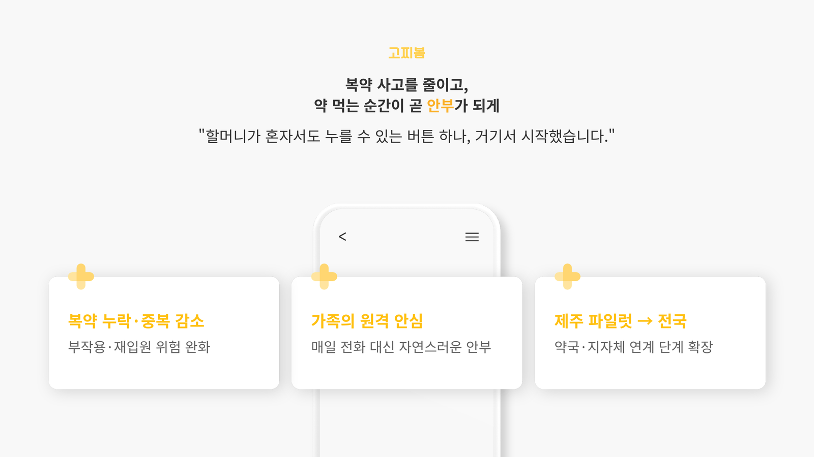

# 🍊 고찌봄

### 약 먹는 순간이, 곧 안부가 되는 서비스

**제주 지역 기반 복약 안부 서비스**

고찌(제주어 `같이`) + 봄(`바라봄 · 살펴봄 · 챙겨봄`)

 

 
 

---

## 🧡 서비스 소개

고찌봄은 약국이 등록한 복약 정보를 바탕으로 어르신의 복약 여부를 가족, 보호자, 요양보호사, 복지사에게 연결하는 **복약 안부 서비스**입니다.

어르신은 복약 알림을 받으면 큰 버튼을 누르고, 먹은 약 포지 사진 한 장을 촬영합니다. 고찌봄은 이 간단한 행동을 복용 기록과 안부 신호로 바꾸어 돌봄 관계자에게 전달합니다.

> 고찌봄은 약을 추천하거나 처방을 바꾸지 않습니다.
>
> 약국이 등록한 복약 정보를 기반으로, 복용 확인과 안부 연결을 돕는 보조 서비스입니다.

---

## 🔍 문제 정의

  

고찌봄은 **제주 지역의 독거노인 복약 관리와 돌봄 공백**에 주목했습니다.

### 어르신에게 복잡한 앱 조작은 장벽입니다

저희는 팀원의 외할머니가 말씀하신 한 문장에서 출발했습니다.

> “한 번은 누르겠는데, 두 번은 너무 헷갈려요.”

젊은 사람에게는 익숙한 두세 번의 터치, 메뉴 이동, 설정 과정이 어르신에게는 실제 사용을 막는 벽이 될 수 있습니다. 그래서 고찌봄은 어르신에게 요구하는 행동을 **큰 버튼 한 번과 사진 한 장**으로 줄였습니다.

### 돌봄 인력은 부족하고, 확인 업무는 계속 늘어납니다

  

고찌봄은 사람의 돌봄을 대체하려는 서비스가 아닙니다. 사람이 꼭 확인해야 할 순간을 더 빨리 발견하고, 복약 확인이 자연스러운 안부 확인으로 이어지도록 돕는 서비스입니다.

### 스마트폰은 있지만, 문제는 복잡함입니다

  

어르신에게 직접 입력과 설정이 많은 앱은 어렵지만, 카메라 촬영은 비교적 익숙한 행동입니다. 고찌봄은 이 점에 주목해 복약 확인을 **카메라 촬영 경험**으로 바꾸었습니다.

---

## 🌊 왜 제주인가

  

고찌봄은 제주를 첫 파일럿 지역으로 설정했습니다.

| 이유 | 설명 |
| --- | --- |
| 고령화와 독거노인 돌봄 | 지역 기반 안부 확인과 복약 관리가 함께 필요한 가구가 늘고 있습니다. |
| 의료 접근성 한계 | 이동이 어려운 어르신일수록 복약 누락과 건강 이상을 빠르게 발견하는 연결이 중요합니다. |
| 복약 사고 위험 | 다제약물 복용, 깜빡 잊음, 중복 복용 같은 문제를 주변 돌봄 관계자가 함께 확인할 필요가 있습니다. |
| 지역 약국 연계 가능성 | 약국, 보건소, 지자체와 연결되는 지역 기반 복약 관리 모델로 확장할 수 있습니다. |

---

## 💡 서비스 구조

  

고찌봄은 어르신, 보호자, 약국, 요양보호사를 하나의 복약 안부 흐름으로 연결합니다.

| 참여자 | 역할 |
| --- | --- |
| 어르신 | 알림을 받고 복약 후 약 포지 사진을 촬영합니다. |
| 보호자·가족 | 복약 완료, 미확인, 확인 필요 상태를 확인합니다. |
| 약국 | 처방 정보를 QR 기반으로 등록할 수 있는 출발점이 됩니다. |
| 요양보호사·복지사 | 복약 이력과 확인 필요 상태를 참고해 돌봄을 이어갑니다. |

---

## 🎨 브랜드와 UX 원칙

  

고찌봄은 제주 감귤의 따뜻한 색감과 돌하르방 캐릭터를 활용해 복약 관리 서비스가 줄 수 있는 차가운 느낌을 낮추고, “챙김”과 “안심”의 인상을 먼저 전달하도록 설계했습니다.

| 원칙 | 설명 |
| --- | --- |
| 터치 한 번 | 알림을 누르면 바로 복약 확인 흐름으로 이어집니다. |
| 복잡함은 밖으로 | QR 등록, 식사 시간, 연락처 설정은 보호자·약국 흐름에 둡니다. |
| 사진 한 장 | 어르신은 먹은 약 포지만 촬영하면 됩니다. |
| 확인 필요 | 미확인을 복용 실패로 단정하지 않고 사람에게 연결합니다. |

---

## 🗂️ Repository

| Repository | 역할 | 주요 기술 |
| --- | --- | --- |
| [Tiki-Taka-FE](https://github.com/TIKI-TAKA-hackathon/Tiki-Taka-FE) | 어르신 화면, 보호자 화면, 복약 알림, QR 등록, 사진 촬영 흐름 | React, TypeScript, Vite, Tailwind CSS |
| [Tiki-Taka-BE](https://github.com/TIKI-TAKA-hackathon/Tiki-Taka-BE) | 복약 안부 도메인 API, 알림·미디어 연동 기반, 배포 인프라 | Kotlin, Spring Boot, PostgreSQL |

---

## 🧪 Demo & Project Info

| 구분 | 내용 |
| --- | --- |
| Live Demo | https://gojjibom.web.app/ |
| Frontend | https://github.com/TIKI-TAKA-hackathon/Tiki-Taka-FE |
| Backend | https://github.com/TIKI-TAKA-hackathon/Tiki-Taka-BE |
| Hackathon | 2026. 6. 30 ~ 2026. 7. 3 |
| Team | Tiki-Taka |

  

---

## 👥 Team Tiki-Taka

| 이름 | 역할 | 담당 |
| --- | --- | --- |
| 김주영 | 팀장 | 서비스 방향성 검토 및 피드백 |
| 허동현 | PM 및 개발 총괄 | FE/BE 설계와 구현 총괄 |
| 박윤아 | 발표 준비 및 자료조사 | 발표 흐름 정리 |
| 강지연 | 서비스 디자인 | UI/브랜딩 디자인 |
| 이재영 | 자료조사 | 수치 근거 정리, TTS 및 발표 보조 자료 준비 |

---

## 🏁 기대효과

  

고찌봄은 대단한 기술보다 **할머니가 혼자서도 누를 수 있는 버튼 하나**에서 시작했습니다.

제주에서 시작한 작은 복약 확인이 더 자연스러운 돌봄 연결로 이어질 수 있도록, Tiki-Taka는 고찌봄을 계속 다듬어갑니다.
